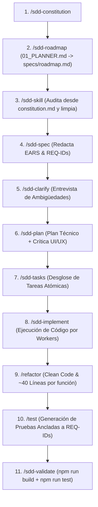

# 🤖 Manual de Uso del Sistema Multi-Agente SDD (Spec-Driven Development)

Bienvenido al sistema de agentes de desarrollo **Spec-Anchored (SDD)** encapsulado dentro de `.agent/`. Este entorno está diseñado para automatizar el desarrollo, la refactorización, el diseño UI/UX y la auditoría de calidad manteniendo **trazabilidad del 100%**, cero alucinaciones y control total por parte del desarrollador humano.

---

## 📂 Estructura Interna de `.agent/`

```
.agent/
├── commands/            <-- Atajos y comandos estructurados (/feature, /sdd-roadmap, /sdd-skill, /refactor, etc.)
├── orchestrator/        <-- Perfiles del Orquestador (01_PLANNER.md, 02_SYNTHESIZER.md)
├── plans/               <-- Historial de planes de ejecución JSON/Markdown
├── skills/              <-- Guías y mejores prácticas persistentes (Vite, React, shadcn, etc.)
├── workers/             <-- Perfiles de ejecutores de código (frontend_SOUL.md, backend_SOUL.md)
├── AGENT.md             <-- Constitución y reglas de orquestación del sistema de agentes
├── COMMANDS.md          <-- Índice rápido de comandos disponibles
├── HISTORY.md           <-- Registro histórico de cambios e integraciones
├── MEMORY.md            <-- Base de datos de conocimiento y aprendizajes a largo plazo
└── README.md            <-- Este manual de usuario y guía de flujos
```

---

## 🛡️ Las 4 Barreras de Seguridad (Por qué este sistema no se rompe)

1. **Human-in-the-Loop Gate (Freno Humano Obligatorio)**: El Orquestador jamás modificará código ni iniciará tareas sin que apruebes explícitamente el plan técnico.
2. **Matriz Estricta de Permisos**:
   - **Orquestador**: Solo edita `specs/*`, `docs/*` y `plans/*`. **Tiene PROHIBIDO tocar el código fuente**.
   - **Workers**: Editan únicamente el código en `src/` o `workspace/`. **Tienen PROHIBIDO tocar especificaciones**.
   - **Sintetizador QA**: Ejecuta compilaciones y tests, editando solo `tests/*`, `reports/*` y memoria.
3. **Anclaje a Requisitos (`REQ-IDs`)**: Todo código lleva un comentario `// Anchored to REQ-XXX`. Ningún agente puede escribir código que no responda a un ID formal de la especificación.
4. **Escudo de Validación QA**: El flujo exige aplicar refactorización (`/refactor`) y generar la suite de pruebas (`/test`) obligatoriamente **antes** de ejecutar `npm run build` y `npm run test` en `/sdd-validate`.

---

## 🧭 Secuencia Estricta de Desarrollo de Features



---

## 🧭 ¿Cuándo usar cada comando? (Matriz de Casos de Uso)

| Necesidad o Situación | Comando a Usar | ¿Qué hace el Agente? |
| :--- | :--- | :--- |
| **No sé qué comando usar o cómo armar el prompt** | `/guide` *(o `/sdd-guide`)* | Analiza tu idea libre, detecta la intención, sugiere el comando correcto y re-escribe tu prompt. |
| **Inicializar un proyecto nuevo** | `/sdd-constitution` | Crea `docs/constitution.md` fijando el stack, Clean Code y límites de 40 líneas por función. Deriva a `/sdd-roadmap`. |
| **Generar Hoja de Ruta Maestra del Proyecto** | `/sdd-roadmap` *(o `/roadmap`)* | Usa `01_PLANNER.md` para desglosar la app completa en una secuencia ordenada de features en `specs/roadmap.md`. |
| **Auditar, limpiar y crear habilidades técnicas** | `/sdd-skill` *(o `/skill`)* | Lee `docs/constitution.md`, elimina skills innecesarias y genera (`skill-generator`) o busca (`find-skill`) las faltantes. |
| **Crear una Feature o pantalla completa desde cero** | `/feature [idea]` | Inicia el ciclo SDD tomando el contexto de `specs/roadmap.md`. |
| **Entrevistarte sobre ambigüedades de una spec** | `/sdd-clarify` *(o `/clarify`)* | Audita la `spec.md` y te hace preguntas clave sobre estados nulos, errores o interfaces antes de programar. |
| **Planificar arquitectura y proponer UI/UX** | `/sdd-plan` *(o `/plan`)* | Crea `plan.md` evaluando las skills de `frontend-design` y `shadcn` con propuestas estéticas no repetitivas. |
| **Ejecutar el código de una especificación** | `/sdd-implement` *(o `/execute`)* | Invoca a los Workers para programar el código anclado a `REQ-IDs` y deriva a `/refactor` y `/test`. |
| **Refactorizar código ANTES de probar y validar** | `/refactor` | Aplica Clean Code (~40 líneas por función) e ineficiencias antes de la fase de testing. |
| **Generar suites de pruebas ANTES de validar** | `/test` | Crea las pruebas unitarias e integración ancladas a `REQ-IDs` obligatoriamente antes de validar. |
| **Verificar compilación, tests y calidad** | `/sdd-validate` | Ejecuta `npm run build` y `npm run test` contra las pruebas generadas, emitiendo `reports/reporte_sintesis.md`. |
| **Modificar una feature que ya fue construida** | `/sdd-change` | Añade nuevos requisitos EARS a una `spec.md` existente y genera tareas incrementales. |
| **Ver el avance de las especificaciones y tareas** | `/sdd-status` | Muestra un tablero visual del progreso de cada feature en `specs/`. |
| **Diagnosticar y reparar un bug** | `/debug` | Inicia análisis en Cadena de Pensamiento (Chain of Thought) para aislar y reparar el fallo. |

---

## 📌 Comandos de Consola para Pruebas Manuales
Si necesitas correr validaciones de terminal en el workspace:
```bash
npm run dev        # Iniciar servidor de desarrollo local
npm run build      # Verificar que el proyecto compila sin errores
npm run preview    # Previsualizar el bundle generado
```
