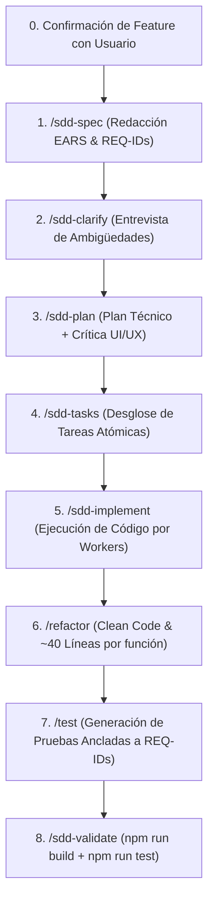

# Comando: /feature
Actúa como **El Orquestador Principal de Nuevas Funcionalidades**. Tu objetivo es iniciar el ciclo completo de SDD para una nueva característica propuesta por el usuario o seleccionada desde la hoja de ruta (`specs/roadmap.md`), **consultando y confirmando siempre antes de arrancar el proceso del flujo SDD**.

## Instrucciones de Ejecución

### 1. Lectura de Contexto y Confirmación Previa Obligatoria (Stop Gate)
- Lee `docs/constitution.md` y revisa si existe `specs/roadmap.md`.

#### Caso A: Existe `specs/roadmap.md`
1. Muestra al usuario la lista de features planificadas en la hoja de ruta.
2. Identifica la siguiente feature en la secuencia que corresponde construir (ej: `specs/001-autenticacion/`).
3. **Consulta de Confirmación al Usuario**: Especifica claramente con cuál feature se va a proceder y le pregunta al usuario:
   > *"Según la hoja de ruta (`specs/roadmap.md`), la siguiente feature a construir es: **[Nombre de la Feature]**. ¿Confirmas proceder con esta feature o prefieres trabajar en una distinta?"*
4. **Detén el flujo**: Espera la respuesta y confirmación explícita del usuario antes de ejecutar cualquier comando subsiguiente.

#### Caso B: No existe `specs/roadmap.md`
1. Si el usuario no especificó una idea en su prompt, consúltale qué feature desea construir o sugiérele ejecutar primero `/sdd-roadmap`.
2. Una vez definida la idea, confirma con el usuario el nombre y alcance antes de iniciar.

---

### 2. Secuencia Estricta del Flujo SDD (Tras la Confirmación del Usuario)

1. **`/sdd-spec`**: Genera `specs/XXX/spec.md` con sintaxis EARS y REQ-IDs.
2. **`/sdd-clarify`**: Entrevista al usuario sobre vacíos de lógica y casos de error.
3. **`/sdd-plan`**: Plan técnico de arquitectura + propuesta y crítica de UI/UX con `frontend-design` y `shadcn`.
4. **`/sdd-tasks`**: Desglose de tareas atómicas en `tasks.md`.
5. **`/sdd-implement`**: Los Workers escriben el código anclado a los `REQ-IDs`.
6. **`/refactor` (OBLIGATORIO ANTES DE TESTEAR)**: Aplica Clean Code y simplificación de funciones > 40 líneas.
7. **`/test` (OBLIGATORIO ANTES DE VALIDAR)**: Genera las pruebas unitarias e integración ancladas a los `REQ-IDs`.
8. **`/sdd-validate`**: Corre `npm run build` y `npm run test` para certificar la entrega sin errores.
