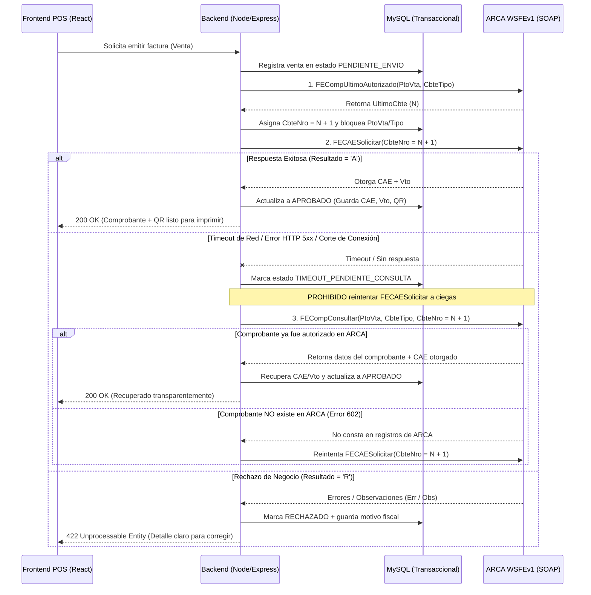

# Project Constitution — Sistema de Facturación Electrónica POS / ERP (ARCA / ex-AFIP)

> **Estado del Documento**: VIGENTE (Ley Suprema del Proyecto bajo Spec-Driven Development - SDD)  
> **Ámbito**: Todos los agentes de IA (`01_PLANNER`, `frontend_SOUL`, `backend_SOUL`, `02_SYNTHESIZER`) y desarrolladores humanos.

---

## Misión y Alcance

Desarrollar una aplicación de **Facturación Electrónica (POS Local / ERP)** moderna, auditable y de alta resiliencia con integración directa y nativa a los Web Services de la **Agencia de Recaudación y Control Aduanero (ARCA / ex-AFIP)** de la República Argentina, bajo la normativa **RG 4291** (y modificatorias como RG 4892 para QR y RG 5616 para condición de IVA receptor).

### Propósito Estratégico
1. **Soberanía Tecnológica y Cero Costos de Licenciamiento**: Eliminar por completo la dependencia de SDKs comerciales, APIs intermediarias pagas o librerías de terceros aranceladas. Toda la capa criptográfica (PKCS#7 / CMS), transporte SOAP 1.1/1.2 y serialización XML se resuelve de forma nativa en el backend con herramientas Open Source gratuitas.
2. **Integridad Fiscal Garantizada**: Asegurar que ningún comprobante fiscal quede en estado incierto ante cortes de internet o timeouts de los servidores de ARCA, garantizando consistencia absoluta entre la base de datos local MySQL y los registros fiscales del organismo.
3. **Experiencia Operativa de Punto de Venta (POS)**: Proveer una interfaz ágil, accesible por teclado y visualmente intencional en React para emisión rápida de comprobantes, control de caja, clientes, productos e impresión de facturas (A4 y ticket térmico 80mm) con código QR oficial.

---

## Arquitectura del Sistema

Para cumplir con las exigencias criptográficas, de red (CORS/SOAP) y de concurrencia fiscal de ARCA, el sistema adopta una **Arquitectura Cliente-Servidor Desacoplada en Capas** alojada dentro de `workspace/`:

### 1. Por qué es Indispensable el Backend (Node.js + Express + MySQL)
En un sistema conectado a ARCA, **nunca puede invocarse a AFIP directamente desde React**:
- **Custodia Criptográfica**: La clave privada (`.key`) y el certificado X.509 (`.pem`/`.crt`) jamás deben viajar al navegador. Residen exclusivamente en el servidor backend fuera de rutas públicas.
- **Restricciones SOAP y CORS**: Los Web Services de ARCA (`WSAA` y `WSFEv1`) operan sobre SOAP 1.1/1.2 XML puro y bloquean peticiones desde navegadores (CORS). El backend actúa como orquestador SOAP seguro.
- **Sincronización de Secuencia y Concurrencia**: Emitir facturas exige consultar `FECompUltimoAutorizado` y enviar números estrictamente correlativos por Punto de Venta (`PtoVta`) y Tipo de Comprobante (`CbteTipo`). El backend en Node.js junto con transacciones ACID en **MySQL** previene condiciones de carrera si dos terminales facturan simultáneamente.
- **Persistencia del Ticket de Acceso (TA)**: El token de ARCA dura 12 horas y ARCA rechaza nuevas solicitudes si ya existe un TA vigente (`coe.alreadyAuthenticated`). El backend centraliza y comparte ese único TA activo.

### 2. Stack Tecnológico Oficial
- **Frontend (`workspace/frontend/`)**:
  - **Core**: React 19 (`.js` / `.jsx`), Vite 8 (Rolldown-powered).
  - **Estilos y UI**: Tailwind CSS v4 (`@import "tailwindcss";`) + **shadcn/ui** (Radix UI + `cn` helper) + `lucide-react`.
- **Backend (`workspace/backend/`)**:
  - **Core**: Node.js (ES Modules `import`/`export`), Express.
  - **Criptografía y SOAP Nativo**: Módulo nativo `node:crypto` / ejecución controlada de `openssl cms` (o `node-forge` open-source) para firma CMS (PKCS#7), `fetch`/`axios` para transporte HTTPS SOAP y parser XML open-source (`fast-xml-parser`).
  - **Generación Gráfica y QR**: Generación del payload JSON Base64 oficial de ARCA renderizado como QR open-source (`qrcode`) y generación de comprobantes imprimibles.
- **Base de Datos Relacional**:
  - **Motor**: **MySQL 8+** con soporte transaccional InnoDB (`mysql2/promise` o ORM ligero configurado en `workspace/backend/src/config/`).
  - **Responsabilidad**: Almacenar ventas, ítems, alícuotas de IVA, clientes, productos, auditoría de peticiones SOAP, caché persistente de Tickets de Acceso (`wsaa_tickets`) y registro inmutable de CAEs otorgados.

### 3. Principios de Arquitectura y Estructura de Directorios (Leyes SDD)

#### I. Modularización y Separación de Responsabilidades (SRP)
- **Frontend (`workspace/frontend/src/`)**: Organización estricta por dominio funcional (`features/[feature]/components`, `services`, `hooks`), código transversal en `shared/ui`, `shared/providers`, `shared/utils`, y rutas globales en `app/`.
- **Backend (`workspace/backend/src/`)**: Arquitectura en capas estricta:
  - `config/`: Conexión a MySQL, variables de entorno y rutas de certificados ARCA.
  - `controllers/`: Controladores **atómicos** (un archivo por acción, ej. `emitInvoice.js`, `getLastVoucher.js`) exportados con `export default function`. Solo manejan `req`/`res` y códigos HTTP.
  - `services/`: Lógica de negocio pura e integración modular con ARCA (`wsaaService.js`, `wsfeService.js`, `qrGeneratorService.js`).
  - `repositories/`: Interacción exclusiva con MySQL mediante consultas parametrizadas y transacciones.
  - `models/`: Esquemas de tablas y entidades de dominio.
  - `routes/` y `middleware/`: Enrutamiento Express, validación de esquemas y manejo centralizado de errores.

#### II. Estándar de UI/UX
- Uso obligatorio de componentes base en **shadcn/ui** (`shared/ui/`).
- Prohibición de diseños genéricos o sin jerarquía visual: la interfaz del POS/ERP debe priorizar legibilidad de importes, estados fiscales claros (Homologación vs. Producción visible en el header), atajos de teclado para facturación rápida y feedback inmediato del estado de conexión con ARCA.

---

## Reglas de Dominio AFIP/ARCA

Estas reglas son **inmutables y no negociables**. Ningún agente puede omitirlas ni simplificarlas:

### 1. Cero Dependencias Aranceladas
- Queda terminantemente prohibido integrar SDKs pagos, servicios SaaS intermediarios de facturación o librerías con licencias comerciales restrictivas. Toda comunicación con `WSAA` y `WSFEv1` se implementa en el código fuente del proyecto.

### 2. Aislamiento Estricto de Entornos (Homologación vs. Producción)
El sistema debe operar bajo configuración explícita por variable de entorno (`ARCA_ENV=homologacion|produccion`), aislando certificados, CUIT emisor y endpoints:
- **Homologación (Testing)**:
  - **WSAA**: `https://wsaahomo.afip.gov.ar/ws/services/LoginCms`
  - **WSFEv1**: `https://wswhomo.afip.gov.ar/wsfev1/service.asmx`
  - Certificados obtenidos vía **WSASS** (Autogestión de Certificados de Homologación).
- **Producción**:
  - **WSAA**: `https://wsaa.afip.gov.ar/ws/services/LoginCms`
  - **WSFEv1**: `https://servicios1.afip.gov.ar/wsfev1/service.asmx`
  - Certificados obtenidos vía **Administrador de Relaciones / Certificados Digitales**.
- Nunca se deben mezclar certificados ni puntos de venta de Homologación con URLs de Producción.

### 3. Autenticación y Gestión Eficiente de Tokens (WSAA)
1. **Generación del TRA (`LoginTicketRequest.xml`)**:
   - Incluye `uniqueId` (entero de 32 bits basado en timestamp), `generationTime` (hora actual menos 5-10 minutos de margen por deriva de reloj NTP), `expirationTime` (hora actual más 12 horas) y `<service>wsfe</service>`.
   - Las fechas se formatean en ISO 8601 con zona horaria de Argentina (`UTC-03:00`).
2. **Firma Criptográfica CMS (PKCS#7)**:
   - El XML del TRA se firma con la clave privada local y el certificado X.509 generando un bloque binario CMS codificado en Base64 sin encabezados MIME (`-nodetach`).
3. **Caché Obligatorio de 12 Horas**:
   - El Ticket de Acceso (`TA`) retornado por `loginCms` contiene `<token>`, `<sign>` y `<expirationTime>`.
   - El backend **DEBE** persistir el TA (en disco seguro y/o tabla MySQL `arca_tokens`) y reutilizarlo en cada llamada a `WSFEv1` mientras `now < expirationTime - margenSeguridad(5 min)`.
   - Está **prohibido** solicitar un nuevo TA por cada comprobante emitido.

### 4. Emisión y Secuencia de Comprobantes (`WSFEv1` - RG 4291)
- **Tipos de Comprobantes Soportados (`CbteTipo`)**:
  - Factura A (`1`), Nota de Débito A (`2`), Nota de Crédito A (`3`).
  - Factura B (`6`), Nota de Débito B (`7`), Nota de Crédito B (`8`).
  - Factura C (`11`), Nota de Débito C (`12`), Nota de Crédito C (`13`).
- **Validaciones Fiscales Previas al Envío (`FECAESolicitar`)**:
  - **Cuadratura de Importes**: `ImpTotal = ImpTotConc + ImpNeto + ImpOpEx + ImpTrib + ImpIVA` (redondeo a 2 decimales exactos).
  - **Condición frente al IVA del Receptor (`CondicionIVAReceptorId` - RG 5616)**: Obligatorio informar el código numérico de condición de IVA del receptor acorde a la clase de comprobante.
  - **Comprobantes Asociados (`CbtesAsoc`)**: Obligatorio en Notas de Crédito y Débito referenciando el comprobante original.
  - **Identificación del Receptor (`DocTipo` / `DocNro`)**: Validación de algoritmo módulo 11 para CUIT/CUIL (`DocTipo = 80 / 86`) y topes vigentes para Consumidor Final (`DocTipo = 99` vs `DocTipo = 96` DNI cuando supera el monto máximo legal sin identificar).

### 5. Persistencia Local y Comprobante Gráfico con QR Oficial (RG 4892)
- Toda venta autorizada debe persistir en MySQL de manera inmutable: `cae`, `cae_vencimiento`, `cbte_numero`, `pto_vta`, `cbte_tipo`, `resultado` (`A`), y el payload de respuesta de ARCA.
- El comprobante gráfico (PDF / vista de impresión) debe incluir obligatoriamente:
  - CAE y Fecha de Vencimiento de CAE.
  - **Código QR Oficial de ARCA**: URL `https://www.afip.gob.ar/fe/qr/?p={BASE64_JSON}` donde `BASE64_JSON` codifica el objeto JSON exigido por ARCA (`ver: 1`, `fecha`, `cuit`, `ptoVta`, `tipoCmp`, `nroCmp`, `importe`, `moneda`, `ctz`, `tipoDocRec`, `nroDocRec`, `tipoCodAut: "E"`, `codAut`).

---

## Estándares de Código y Seguridad

### 1. Reglas de Clean Code y Límites Estrictos de Tamaño
- **Límite por Función / Componente**: Ninguna función, método, custom hook o componente de React puede superar aproximadamente las **40 líneas de código**.
- **Límite por Archivo**: Ningún archivo de código fuente (`.js`, `.jsx`) puede superar las **100 líneas de código**. Si excede este umbral, debe dividirse inmediatamente en submódulos, helpers o subcomponentes atómicos.
- **Estilo Sintáctico**:
  - **Sin punto y coma (`;`)**: Uso de inserción automática de punto y coma (ASI) en todo el código JS/JSX.
  - **Declaración de Componentes y Controladores**: Usar siempre `export default function Nombre() {}` en componentes React y controladores Express.
  - **Código Auto-Documentado**: Prohibidos los comentarios redundantes que explican *qué* hace el código; usar nombres de variables y funciones semánticos.

### 2. Seguridad de Certificados y Credenciales
- Los archivos `.key`, `.pem`, `.crt`, `.pfx`, tickets `TA.xml` y archivos `.env` deben estar **obligatoriamente excluidos en `.gitignore`** desde el primer commit.
- Las rutas a los certificados y las credenciales de MySQL se inyectan exclusivamente vía variables de entorno validadas al iniciar el backend.
- Prohibido exponer trazas SOAP crudas con `Token` o `Sign` en respuestas HTTP hacia el cliente frontend o en logs públicos.

### 3. Estrategia de Pruebas y Gobernanza SDD
- **Trazabilidad por `REQ-IDs`**: Todo test unitario o de integración debe estar anclado a los identificadores de requisitos (`REQ-XXX`) definidos en `specs/`.
- **Mocks Deterministas de ARCA**: Las pruebas automatizadas de `WSAA` y `WSFEv1` deben incluir fixtures de respuestas SOAP reales (aprobación, rechazo con observaciones, timeout de red y token expirado) ubicadas en carpetas `__tests__/` o `tests/` persistentes.
- **Control de Cambios SDD**: Ningún agente Worker (`frontend_SOUL`, `backend_SOUL`) puede modificar código sin una especificación (`spec.md`) y un plan de tareas (`tasks.md`) previamente aprobados por el usuario (Human Gate).

---

## Protocolos de Manejo de Errores y Contingencia

La facturación electrónica sobre internet pública está expuesta a microcortes e inestabilidad de los servidores de ARCA. El sistema implementa el siguiente protocolo determinista:

### Reglas de Contingencia Obligatorias
1. **Protocolo Anti-Duplicación ante Timeouts (`FECompConsultar`)**:
   - Si durante la ejecución de `FECAESolicitar` ocurre un timeout de red, caída de socket o error HTTP `502/503/504`, la aplicación **TIENE PROHIBIDO** volver a llamar a `FECAESolicitar` directamente.
   - Antes de cualquier reintento, el servicio backend **DEBE** invocar `FECompUltimoAutorizado` y `FECompConsultar` para el número de comprobante intentado (`CbteNro`).
   - Si ARCA llegó a procesarlo antes de que se cortara la respuesta, `FECompConsultar` devolverá el `CodAutorizacion` (CAE) y `FchVto`, permitiendo reconciliar y aprobar la factura en MySQL sin duplicar la operación ni romper la correlatividad.
2. **Desfase de Numeración (`FECompUltimoAutorizado`)**:
   - Antes de construir el payload de `FECAESolicitar`, el backend verifica el último comprobante autorizado en ARCA (`FECompUltimoAutorizado`) y lo contrasta con la base de datos local MySQL. Si existe un desfase (por ejemplo, se emitió un comprobante desde el portal web de ARCA Comprobantes en Línea), el sistema sincroniza o alerta antes de enviar.
3. **Verificación de Salud de Servidores (`FEDummy`)**:
   - El backend expondrá un endpoint de diagnóstico conectado al método `FEDummy` de ARCA (`AppServer`, `DbServer`, `AuthServer`) para mostrar en tiempo real en el POS si los servidores de ARCA están operativos (`OK`) o con caída del servicio.
4. **Traducción Humana de Errores y Observaciones SOAP**:
   - Los bloques `<Errors>` y `<Observaciones>` devueltos por ARCA deben ser interceptados por el backend, registrados con su código oficial en MySQL, y traducidos a mensajes accionables en el frontend (ej. *Error 10016: El número o fecha del comprobante no se corresponde con el próximo a autorizar*).
